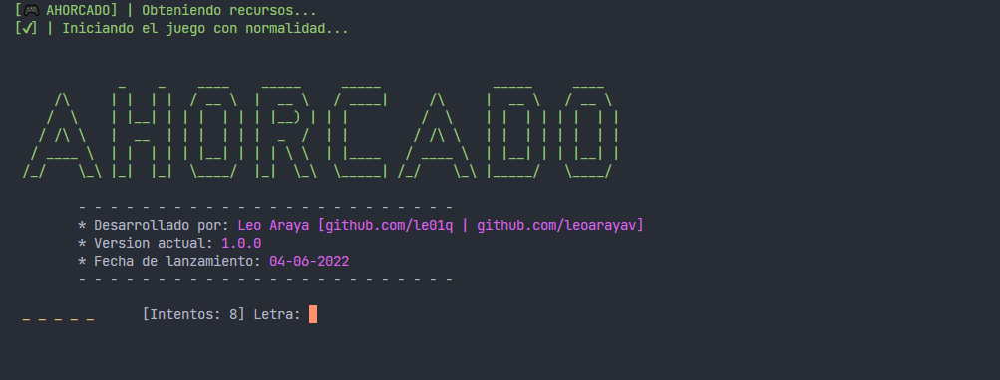

### Ahorcado 🎮
Juego del ahorcado hecho en **python**

### Detalles 📜
- Version: 1.0.0.
- Tipo: Adivinanza.
- Lenguaje: **Python**

### Requerimientos 💻
- Python: **3.9^**
- Modulos: **colorama**, **random (POR DEFECTO)**

### Uso 🎇
1. Descargar los archivos del repositorio
    > El archivo `ahorcado.py` es el principal.

2. Abrir la terminal de tu editor de codigo.

3. Ejecutar el programa via consola:
    > python `ahorcado.py`

### Capturas 📷
